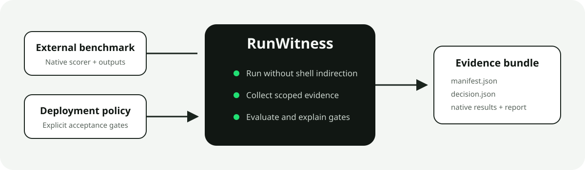
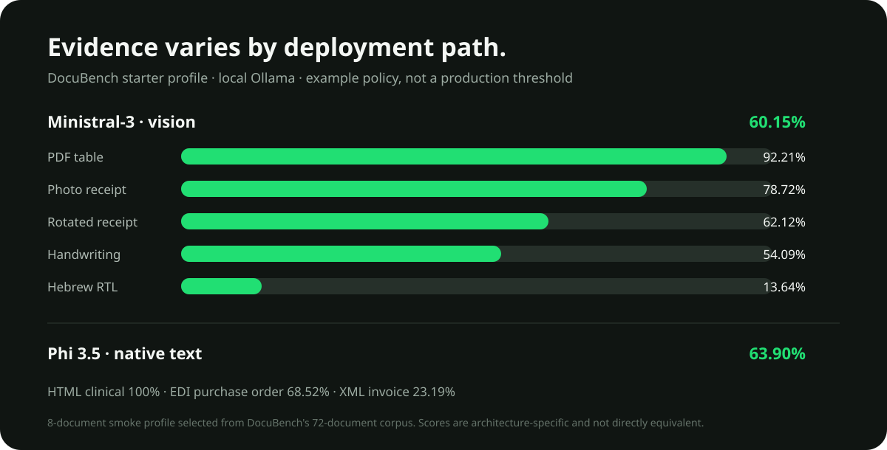

<p align="center"></p>
<h1 align="center">FieldKit</h1>
<p align="center"><strong>Deployment evidence around the benchmark you already trust.</strong></p>
<p align="center">
  <a href="https://github.com/shivamsngh/fieldkit/releases/tag/v0.1.0"></a>
  <a href="LICENSE"></a>
  
</p>

FieldKit runs an independent AI benchmark, preserves its native results, captures
operational context, and evaluates explicit deployment gates. The benchmark
continues to own its datasets, execution, and scoring; FieldKit answers the next
question: **did this model and system satisfy the declared requirements of this
deployment?**



## Why FieldKit

A quality score is not a production decision. Sovereign, regulated, private, and
air-gapped environments also need evidence about runtime, resources, isolation,
provenance, and acceptance criteria. FieldKit packages those facts without
absorbing or redefining the benchmark.

- **Benchmark-agnostic:** execute any tool that exposes a command and JSON results.
- **Native results preserved:** benchmark artifacts are copied unchanged and hashed.
- **Evidence is scoped:** declared, enforced, observed, and unavailable facts stay distinct.
- **Decisions are explicit:** gates resolve to `pass`, `fail`, `unknown`, or `invalid`.
- **Offline-friendly:** no FieldKit service, account, or runtime dependency is required.

## Real evidence from v0.1.0

The reference integration ran local Ollama models against eight cases selected
from DocuBench's existing 72-document corpus. This is an integration smoke
profile—not a replacement for the full benchmark and not a production threshold.



The variation is the point: an aggregate alone hides that Ministral-3 reached
92.21% on a PDF table but only 13.64% on a Hebrew RTL invoice. FieldKit retains
the native evidence needed to make that distinction.

## Quick start

```bash
git clone https://github.com/shivamsngh/fieldkit.git
cd fieldkit
python3 -m venv .venv
source .venv/bin/activate
python3 -m pip install -e .

python3 -m fieldkit validate examples/fixture_benchmark/fieldkit.json
python3 -m fieldkit run examples/fixture_benchmark/fieldkit.json --output runs/fixture-001
open runs/fixture-001/report.html
```

Use a new output directory for every run. FieldKit will not overwrite an
existing evidence bundle.

## Verify and compare evidence

```bash
python3 -m fieldkit verify runs/fixture-001
python3 -m fieldkit compare runs/baseline runs/candidate
```

`verify` recalculates native-result hashes and detects missing or modified
artifacts. `compare` produces a machine-readable metric delta across two bundles.

## Process-tree evidence (v0.2 preview)

FieldKit now includes an optional Rust collector that launches the benchmark and
samples its descendant process tree. It records peak tree RSS, peak process count,
observed process identity, collection interval, and an explicit observation scope.
The Python runner turns those facts into gateable metrics while preserving the
collector's original `evidence/system.json`.

```bash
cargo build --release --manifest-path collector/Cargo.toml
```

See the [collector setup and evidence boundary](docs/system-collector.md). This
preview is additive: existing configurations continue to work without Rust.

## Adapter contract

An adapter declares benchmark identity, an argv command, native result files,
JSON metric paths, a named deployment policy, and optionally its own virtual
environment. Commands run without a shell, and result paths may not escape the
benchmark working directory. See the [adapter contract](docs/adapter-contract.md)
and [runnable fixture](examples/fixture_benchmark/fieldkit.json).

## Ollama + DocuBench

The reference adapters keep three clean boundaries:

1. Ollama and the selected model produce schema-shaped document extractions.
2. DocuBench validates and scores those results with its original scorer.
3. FieldKit records deployment evidence and evaluates gates.

No DocuBench source, documents, labels, schemas, or scoring logic are vendored.
See the [complete workflow](docs/ollama-docubench.md), the
[Ministral-3 vision adapter](examples/docubench/fieldkit.json), and the
[Phi 3.5 text adapter](examples/docubench/fieldkit-phi35.json).

## Evidence boundaries

Without the optional collector, FieldKit directly measures the adapter process.
With it, FieldKit samples the benchmark's descendant tree. The Ollama adapter also
records Ollama-reported model allocation and VRAM through its local API. Neither
is presented as whole-machine peak memory. Likewise, declaring a target
air-gapped is not treated as proof of isolation.

Planned assurance work includes GPU telemetry, OS-level network isolation and
observation, signed attestations, independent offline verification, and
Kubernetes/private-cloud collectors.

## Development

```bash
python3 -m unittest discover -s tests -v
python3 -m pip wheel . --no-deps --wheel-dir dist
```

See the [changelog](CHANGELOG.md) for release history.

## License and benchmark boundaries

FieldKit is MIT licensed. External benchmarks and datasets retain their own
licenses and terms. FieldKit is not affiliated with DocuPipe, DocuBench, Ollama,
Microsoft, or Mistral AI.
